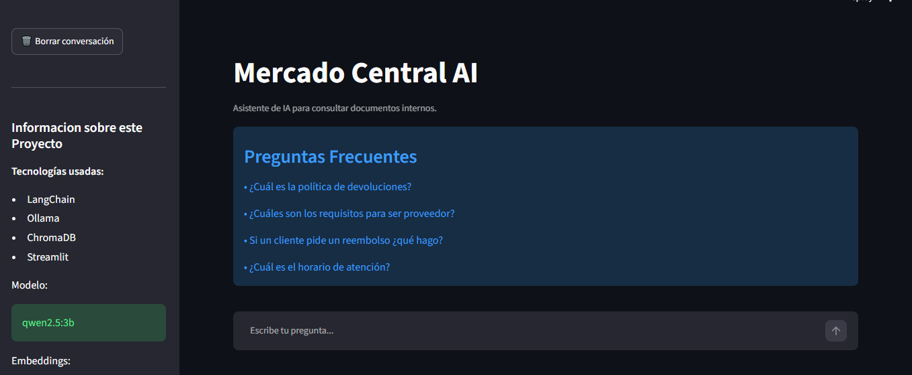
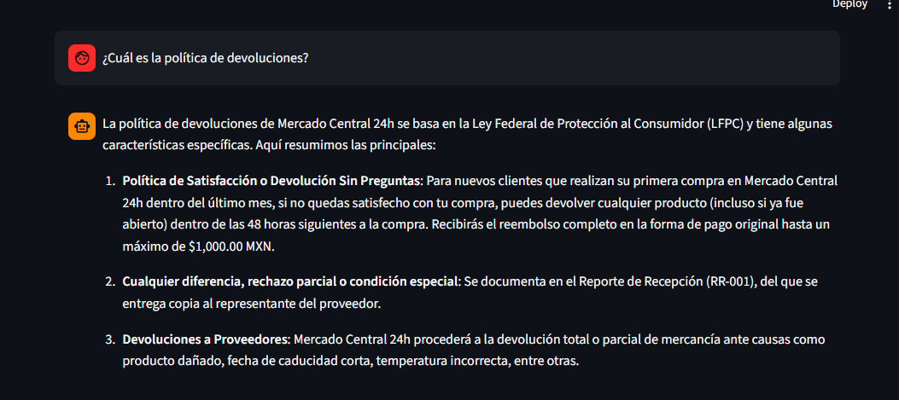

# Mercado Central AI

Asistente inteligente basado en IA para consultar documentación interna de un supermercado mediante técnicas RAG (Retrieval-Augmented Generation).

## Arquitectura de la solución
```text
            Usuario
               │
               ▼
         Streamlit (Interfaz)
               │
               ▼
      LangChain (Orquestación)
               │
               ▼
      ChromaDB (Búsqueda semántica)
               │
               ▼
      Qwen 2.5 3B (Ollama)
               │
               ▼
      Respuesta + Fuentes
```

## Estructura
```text
mercado-central-ai/
│
├── app.py                   ---> Interfaz principal desarrollada con Streamlit.
├── crear_base.py            ---> Carga los archivos y crea la base vectorial ChromaDB.
├── README.md                ---> Documentación del proyecto.
├── requirements.txt         ---> Lista de dependencias necesarias para ejecutar el proyecto.
│
├── src/
│   ├── chatbot.py           ---> Probando la lógica del asistente: información, prompt y el LLM.      
│   ├── loader.py            ---> Carga los archivos, Convierte información en documentos de LangChain y los divide en chunks.
│   └── vectorstore.py       ---> Genera los embeddings y almacena los documentos en ChromaDB.
│
├── tests/
│   ├── test_chat.py         ---> Probar el chatbot desde la consola
│   └── test_loader.py       ---> Verifica que los documentos se carguen correctamente y el contenido indexado
|
├── Imagenes/
|   ├── Consulta.PNG         ---> Una imagen de una consulta
│   └── inicio.PNG           ---> Una imagen de la pantalla principal
|
│
├── Documentos/              ---> Contiene los documentos fuente utilizados por el sistema RAG
├── chroma_db/               ---> Base de datos vectorial donde se almacenan los embeddings
└── .venv/                   ---> Entorno virtual con todas las librerías del proyecto.
```

## Tecnologías
- Python
- Streamlit
- LangChain
- Ollama
- ChromaDB
- Qwen 2.5 3B
- Nomic Embed Text

## Funcionalidades

- Consulta de documentos internos.
- Consulta de preguntas frecuentes.
- Respuestas con referencia al documento y página.
- Boton para borrar conversación. 

## Ejecución de forma local

### 1. Crear la base vectorial

```bash
python crear_base.py
```

### 2. Ejecutar la aplicación

```bash
streamlit run app.py
```

# Capturas de la aplicación

## Pantalla principal



---

## Consulta realizada



---


